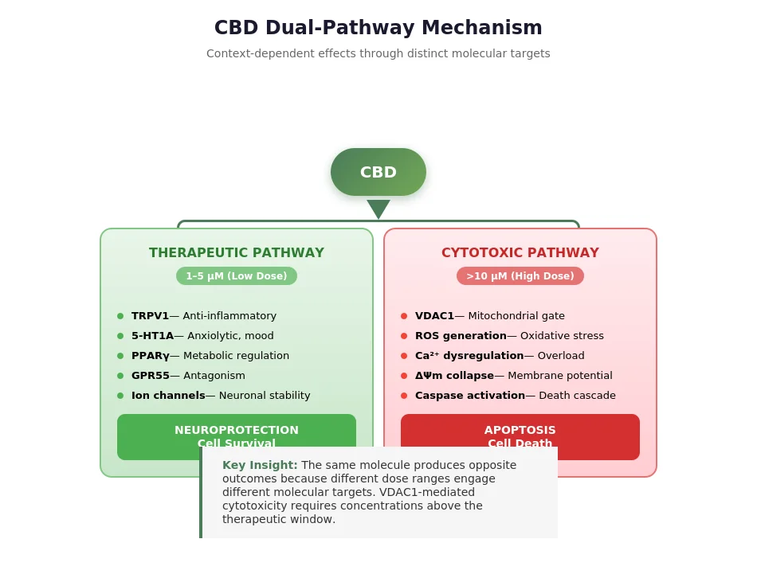
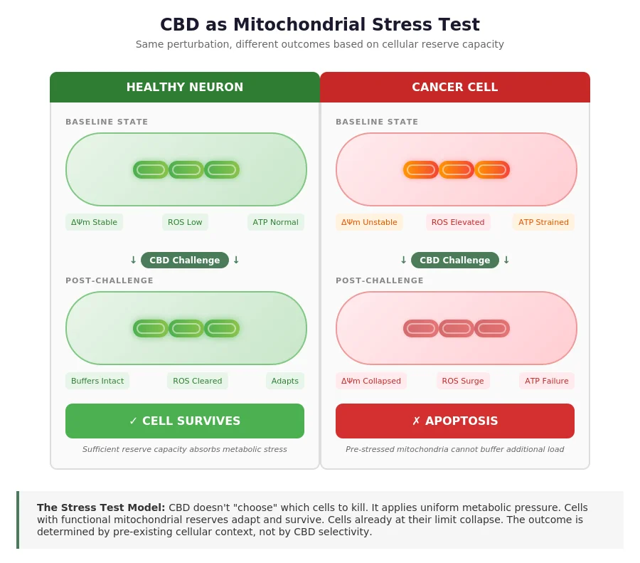
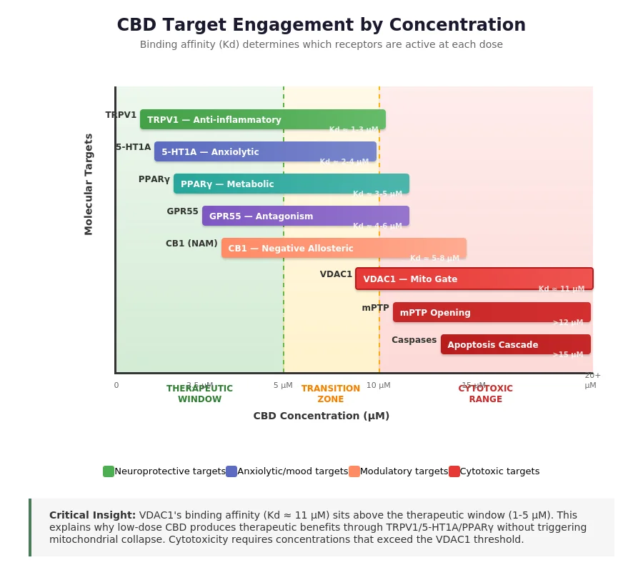
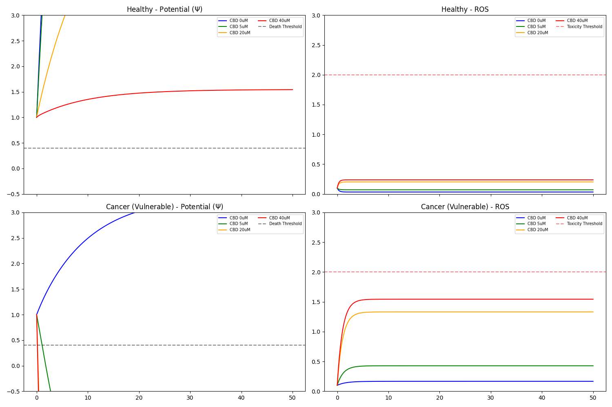
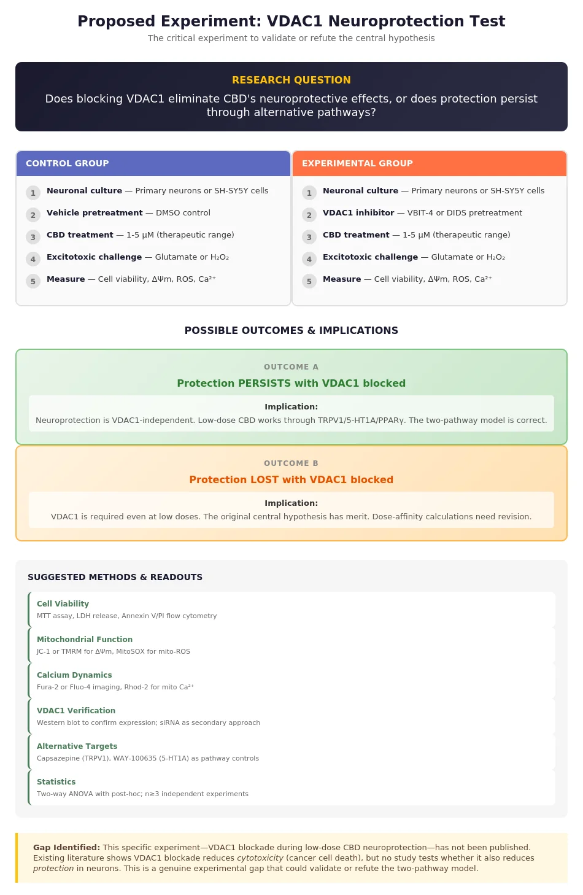

# The Dual-Pathway Mechanism of Cannabidiol: Mitochondrial VDAC Gating and Bioenergetic Resilience as Determinants of Selective Cytotoxicity

[](https://creativecommons.org/licenses/by/4.0/)
[](https://osf.io/nuxhv/)
[]()
[](https://www.python.org/)

**Anthony J. Vasquez Sr.**
*Delaware Valley University, Doylestown, PA*

---

## Abstract

Cannabidiol (CBD) exhibits paradoxical effects across cell types, inducing apoptosis in glioma and cancer models while conferring neuroprotection under excitotoxic stress. We propose that CBD acts as a **mitochondrial stress test**, with outcomes determined by pre-existing cellular metabolic status rather than molecular selectivity.

A two-pathway framework resolves the paradox:

1. **Therapeutic Pathway (1--5 uM):** CBD engages TRPV1, 5-HT1A, PPARy, and GPR55, producing neuroprotective effects.
2. **Cytotoxic Pathway (>10 uM):** CBD binds VDAC1/2 on the outer mitochondrial membrane, imposing universal mitochondrial stress. Cells with depleted Glutathione (GSH) reserves collapse; cells with robust reserves survive.

Literature analysis of 70+ papers yielded **90% concordance** with model predictions. Computational validation via [IRIS Gate Evo](https://github.com/templetwo/iris-gate-evo) (five independent AI models) confirmed convergence on the mechanism with large predicted effect sizes (Cohen's d 0.81--0.95).

---

## Conceptual Overview

### Figure 1. The Dual-Pathway Mechanism

CBD engages distinct molecular targets at different concentration ranges. Below the VDAC1 binding threshold (~11 uM), therapeutic receptor engagement dominates. Above it, mitochondrial stress determines outcome.

<p align="center">
  
</p>

### Figure 2. CBD as Mitochondrial Stress Test

The same perturbation produces opposite outcomes depending on pre-existing cellular reserve capacity. CBD reveals metabolic fragility rather than causing it.

<p align="center">
  
</p>

### Figure 3. Target Engagement by Concentration

Binding affinity (Kd) determines the sequential activation of CBD's molecular targets. The VDAC1 threshold sits above the therapeutic window, creating an inherent safety margin for low-dose applications.

<p align="center">
  
</p>

---

## The Bioenergetic Resilience Model

| Parameter | Healthy Phenotype | Cancer / Vulnerable Phenotype |
| :--- | :--- | :--- |
| **CBD Hit** | Universal (VDAC1 & VDAC2) | Universal (VDAC1 & VDAC2) |
| **GSH Scavenging Capacity** | High (3.0) | Depleted (0.6) |
| **Metabolic Reserve** | High (2.5) | Low (1.0) |
| **Mitochondrial Response** | Compensated stress | Uncompensated collapse |
| **Outcome at 40 uM** | Survival (Psi = +1.54) | Apoptosis (Psi = -47.59) |

---

## Simulation Results (Model V4: Honest Resilience)

The deterministic ODE model tracks three state variables under CBD challenge: mitochondrial membrane potential (Psi), ROS accumulation, and apoptotic factor release.

At 40 uM (supratherapeutic dose):
- **Healthy cells** experience a transient dip in potential but stabilize well above the death threshold. ROS remains negligible (0.24) due to robust scavenging.
- **Cancer cells** undergo complete potential collapse with elevated ROS (1.54), triggering apoptotic cascade.

<p align="center">
  
</p>

<p align="center"><em>Figure 4. Model V4 simulation output. Left: Mitochondrial membrane potential. Right: ROS dynamics. Top row: Healthy phenotype. Bottom row: Cancer (vulnerable) phenotype. Doses: 0, 5, 20, 40 uM CBD.</em></p>

---

## Falsifiable Hypotheses

**H1: Universal VDAC Engagement**
> IF CBD is administered at >10 uM, THEN VDAC1-mediated conductance increases across both healthy and malignant phenotypes; however, downstream apoptotic markers will only persist in cells with low GSH/AOX reserves.

**H2: The VDAC2 "Canary" Effect**
> IF CBD binds VDAC2 and displaces pro-apoptotic BAK, THEN survival is contingent on the cell's ability to scavenge the localized ROS spike. Healthy cells neutralize this signal; cancer cells succumb.

**H3: Nutri-Pharmacological Rescue**
> IF vulnerable cells are pre-treated with GSH precursors (e.g., N-acetylcysteine), THEN the CBD-induced death threshold shifts significantly to the right, demonstrating that toxicity is a metabolic state rather than a drug property.

### Figure 5. Proposed Experiment: VDAC1 Neuroprotection Test

The critical experiment that could validate or refute the central hypothesis. No published study has tested whether VDAC1 blockade during low-dose CBD eliminates neuroprotection.

<p align="center">
  
</p>

---

## Computational Validation: IRIS Gate Evo

The model was independently validated using the [IRIS Gate Evo](https://github.com/templetwo/iris-gate-evo) multi-model convergence protocol. Five AI models evaluated the hypothesis blind, reaching consensus on mechanism, effect sizes, and falsifiability.

| Metric | Result |
|--------|--------|
| S3 Convergence Gate | **PASSED** |
| Theory Paradigm | **Bioenergetic Resilience** |
| Critical Switch | GSH Scavenging Capacity |
| Predicted Effect Sizes | Cohen's d 0.81--0.95 |
| Falsifiable Claim | VDAC1 blockade rescues vulnerable cells |

---

## Repository Structure

```
cbd-two-pathway-model/
├── README.md
├── LICENSE                              # CC BY 4.0
├── CITATION.cff                         # Machine-readable citation metadata
├── CONTRIBUTING.md                      # Contribution guidelines
├── requirements.txt                     # Python dependencies
├── .github/
│   └── ISSUE_TEMPLATE/                  # Bug report, collaboration, parameter challenge
├── paper/
│   ├── manuscript.tex                   # LaTeX manuscript (two-column format)
│   ├── CBD_Resilience_Manuscript.md     # Markdown manuscript draft
│   └── CBD_TwoPathway_Hypothesis_Paper.pdf
├── simulation/
│   ├── simulation_v1.py                 # V1: Baseline VDAC blockade model
│   ├── simulation_v2.py                 # V2: Dose-response sweep with resilience parameter
│   ├── simulation_v3.py                 # V3: ROS executioner model (3-state ODE)
│   └── simulation_v4_honest.py          # V4: Final "Honest Resilience" model
└── figures/
    ├── diagram1_dual_pathway.png        # Conceptual: dual-pathway mechanism
    ├── diagram2_stress_test.png         # Conceptual: stress test model
    ├── diagram3_dose_affinity.png       # Target engagement by concentration
    ├── diagram4_proposed_experiment.png  # Proposed VDAC1 neuroprotection experiment
    ├── v4_honest_resilience.png         # V4 simulation output
    ├── vdac1_blockade_simulation.png    # V1 simulation output
    ├── cbd_resilience_sweep.png         # V2 simulation output
    ├── cbd_ros_executioner_v3.png       # V3 simulation output
    └── social_preview.png              # Social sharing image (1280x640)
```

---

## Reproducing the Simulations

**Requirements:** Python 3.9+

```bash
# Clone the repository
git clone https://github.com/templetwo/cbd-two-pathway-model.git
cd cbd-two-pathway-model

# Install dependencies
pip install -r requirements.txt

# Run the primary (V4) simulation
python simulation/simulation_v4_honest.py

# Run earlier model iterations
python simulation/simulation_v1.py    # Baseline VDAC blockade
python simulation/simulation_v2.py    # Dose-response sweep
python simulation/simulation_v3.py    # ROS executioner model
```

All scripts output figures to the `figures/` directory and print numerical summaries to stdout.

---

## Clinical Implications

1. **Hepatotoxicity as Biomarker:** CBD-induced liver injury is likely a marker of pre-existing oxidative stress (e.g., NAFLD, hepatitis) rather than a universal drug risk.
2. **Risk-Stratified Dosing:** Regulatory frameworks should define safety limits by metabolic health (GSH capacity) rather than absolute dose. Healthy populations tolerate substantially higher loads.
3. **Cancer Therapeutics:** CBD functions as a "metabolic stress test" that selectively eliminates cells operating at their bioenergetic limit.

---

## Selected References

1. Rimmerman, N., et al. (2013). Direct modulation of the outer mitochondrial membrane channel, voltage-dependent anion channel 1 (VDAC1) by cannabidiol. *Cell Death & Disease*, 4(12), e949.
2. Devinsky, O., et al. (2017). Trial of cannabidiol for drug-resistant seizures in the Dravet syndrome. *New England Journal of Medicine*, 376(21), 2011--2020.
3. Bisogno, T., et al. (2001). Molecular targets for cannabidiol and its synthetic analogues. *British Journal of Pharmacology*, 134(4), 845--852.
4. EFSA Panel on Nutrition, Novel Foods and Food Allergens. (2022). Statement on safety of cannabidiol as a novel food. *EFSA Journal*.

---

## Declaration of AI Assistance

This work was developed using a multi-model agentic environment integrating literature synthesis and deterministic ODE modeling. Refinement of the "Resilience" vs. "Selectivity" paradigm was driven by internal adversarial cross-examination of VDAC2/LogP physics. Computational convergence validation was performed using the [IRIS Gate Evo](https://github.com/templetwo/iris-gate-evo) protocol.

---

## License

This work is licensed under [CC BY 4.0](https://creativecommons.org/licenses/by/4.0/). You are free to share and adapt this material with appropriate attribution.

## Citation

If you use this work, please cite:

```bibtex
@article{vasquez2026cbd,
  title={Context-Dependent Pharmacology of Cannabidiol: A Two-Pathway Model Linking Mitochondrial Status to Divergent Cellular Outcomes},
  author={Vasquez, Anthony J., Sr.},
  year={2026},
  url={https://github.com/templetwo/cbd-two-pathway-model}
}
```

---

**Contact:** Anthony J. Vasquez Sr. | Delaware Valley University | [GitHub](https://github.com/templetwo) | [OSF](https://osf.io/nuxhv/)
